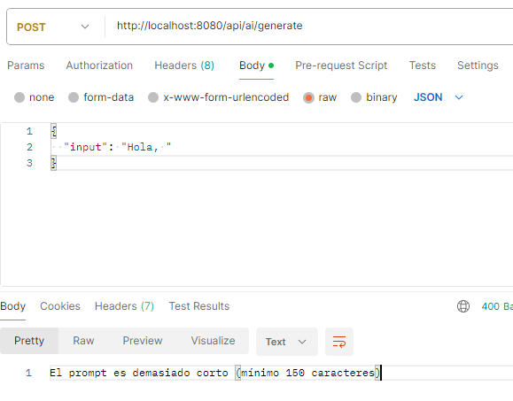
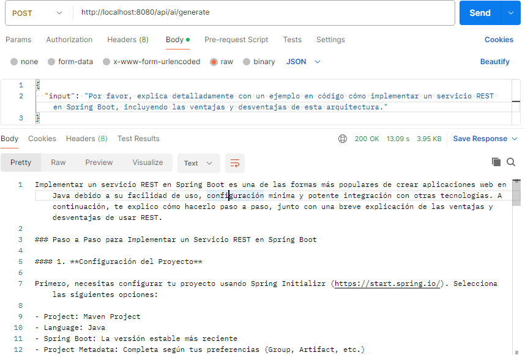
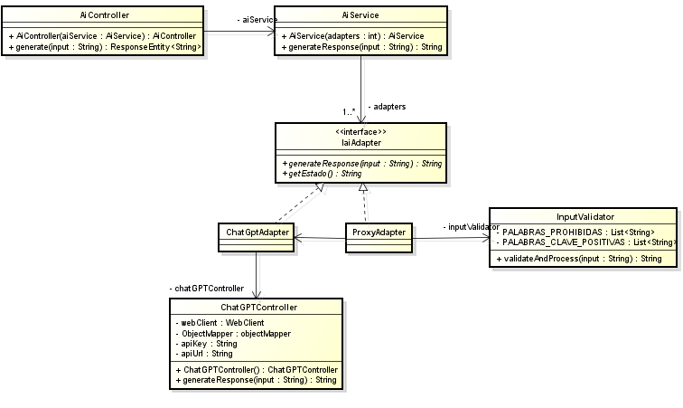

# Parcial intersemestral

# Implementación del patrón de diseño proxy a una aplicacion de integración de IA en aplicaciones web, añádiendo un módulo de validación de entradas.

Tomando como base el proyecto de [ginnko2019/aaintegration](https://github.com/ginnko2019/aaintegration), se ha implementado un patrón de diseño proxy para añadir una capa de validación de entradas
antes de que las solicitudes sean procesadas por el servicio de IA. Este enfoque permite interceptar y validar las solicitudes, asegurando que solo se envíen
datos válidos al servicio de IA.

## Instalación

Requisitos:

* Java 17+

* Maven 3.8+

* Claves API para OpenAI y Azure OpenAI

## Uso

Endpoints

| Metodo  | Ruta    | Descripcion |
|---------|---------|-------------|
| POST| /api/ai/generate | Procesa prompts de usuario     |

* Ejemplo de un uso incorrecto:

* Ejemplo de uso correcto

## Validación de Entradas

Se ha implementado un módulo de validación de entradas que intercepta las solicitudes antes de que sean procesadas por el servicio de IA.

Este módulo valida ciertos aspectos de las solicitudes, como la longitud del prompt, la presencia de caracteres no permitidos, calidad del texto, etc.
.

## Diagrama de clases

# Implementacion de API alphavantage

Ahora se añadieron nuevas clases para la gestion de la nueva api

Clases:

AlphavantageAdapter
StockController

Tambien se diseño un metodo el cual toma las dos respuestas a las peticiones realizadas, las junta y arreglas un
prompt para enviar a chatgpt, el cual nos da una respuesta de en cual de las dos acciones es mejor invertir

 
## Despliegue en AWS

Usando una instancia EC2 y añadiendo en las reglas la apertura del puerto 8080
usando el siguiente link para enviar las solicitudes http
[despliegue](http://44.211.213.39:8080/consult/consultStock)

